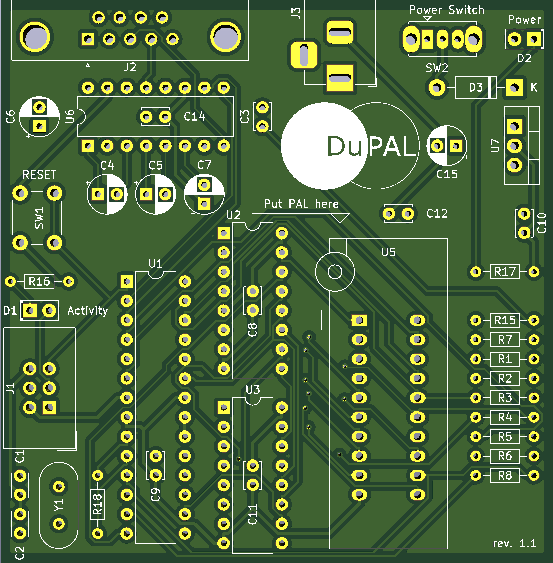
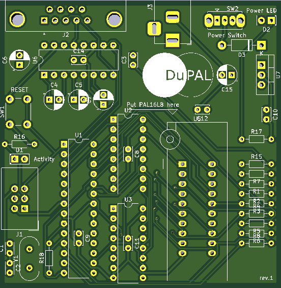

# Board Revisions

## Rev. 1.1 (2020-08-17)

- Fixed the ugly silkscreen from rev.1

## Rev. 1 (2020-??-??)

First produced  version of the board, recognizable by a "rev.1" on the bottom right corner.

- Supports 20 pin PAL devices
- RS232 interfacing

## Rev. 0 (2019-??-??)

First design, was never produced. Had some ICs too near to actually fit.
