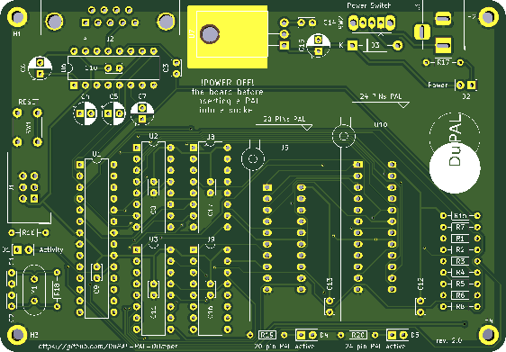

# DuPAL board

## DISCLAIMER

Any use of this project is **under your own responsibility**.
You will be responsible of checking the correct construction and functionality of your board and the compatiblity of the chips You will insert into it.
By using this project You will agree that I cannot be held responsible if it will destroy any of your devices, damage your computer, burn down your house or whatever.

**Do NOT come to me for hand-holding** using this. It is NOT a plug-and-play tool, and it is something I created **for my own use** and I released in case someone might have an use for it.

## Introduction

The DuPAL board is a simple circuit that mounts an AVR MCU (A classic ATmega328P of Arduino fame), three 74HC595 SIPO registers, one 74HCT166 PISO register, a MAX232 to adapt the serial port to RS232, a linear voltage regulator and a bunch of other passive components.

This board was designed and built to help myself bruteforce PAL devices. It has the hardware facilities necessary to scan all the inputs of the PAL, to check whether an output is high, low or hi-z and to report back the status to the host.

Details on how the features are implemented can be found on the Firmware's repository.



## Software

### Bootloader

This board uses the [Optiboot Bootloader](https://github.com/Optiboot/optiboot), currently at version 8.0, built for an **ATMega328** running at 20Mhz, and with a baudrate of 57600bps.

The command line to build the bootloader is

```shell
make atmega328 AVR_FREQ=20000000L LED_START_FLASHES=8 BAUD_RATE=57600
```

See [Compiling Optiboot](https://github.com/Optiboot/optiboot/wiki/CompilingOptiboot) for details.

The resulting bootloader can then be loaded via the ISP header. For example, by using `avrdude` and an **AVR Dragon** programmer:

```shell
avrdude  -c dragon_isp -P usb \
  -p atmega328p -e -u -U efuse:w:0xFD:m -U hfuse:w:0xDE:m \
  -U lfuse:w:0xFF:m -U flash:w:optiboot_atmega328.hex
```

### Firmware

Details on the firmware can be found on the **DuPAL_Firmware** repository.

## Hardware

The board was designed with [KiCad](https://kicad.org/) EDA.

In its current form, the board is a pretty simple build, using exclusively through-hole components.

### Powering the board

The board can be powered with a DC supply voltage between 7.5V and 9V, 12V is possible but the regulator starts to get hot.

The power connector has a positive tip, and is protected against reverse voltage by a 1N4001 diode.

### Bill of Materials

- **SW2** - Sliding SPST switch
- **J1** - 3x2 pins 2.54mm pcb male header
- **C4, C5, C6 & C7** - 4x 1uF / 35v min electrolytic capacitors
- **C15** - 1x 0.22uF / 35v min electrolytic capacitor
- **C3, C8, C9, C10, C11, C12, C13, C14, C16, C17** - 10x 100nF ceramic bypass capacitors
- **C1 & C2** - 2x 22pF NP0 ceramic capacitors
- **R18** - 1x 1Mohm 1/4W resistor
- **R17** - 1x 1.2k 1/4W resistor
- **R16, R19 & R20** - 3x 680ohm 1/4W resistor
- **R1, R2, R3, R4, R5, R6, R7, R8 & R15**, 9x 10Kohm 1/4W resistors
- **D1, D2, D4 & D5** - 4x 3mm LED (recommended red for power, green for activity)
- **J3** - Power supply female barrel connector
- **J2** - DB9 female angled connector
- **SW1** - 4 pin push button
- **D3** - 1N4001 diode
- **U2, U3 & U9** - 3x 74HC595
- **U8** - 1x 74HCT166
- **U6** - MAX232
- **U7** - 7805 TO220 regulator
- **U1** - ATMega328p
- **Y1** - 20Mhz HC49 crystal
- **U5** - 20pin slim ZIF socket
- **U10** - 24pin slim ZIF socket
- *Heat sink for the power regulator (optional, but recommended)*
- *5x 16pin socket (optional)*
- *1x 28pin slim socket (optional)*

Thanks @Porchy for the updated BOM.

## TODO

* New version with additional 74HCT166 to support PAL20L10 chips...

