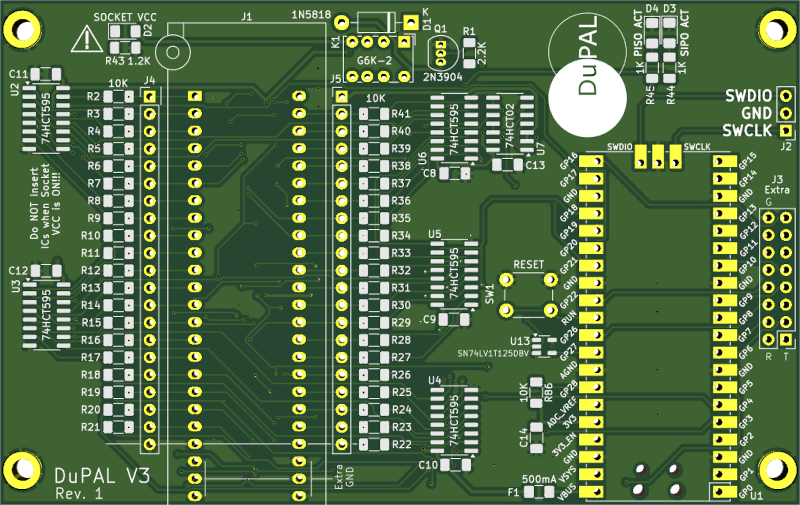

# DuPAL board

## DISCLAIMER

Any use of this project is **under your own responsibility**.
You will be responsible of checking the correct construction and functionality of your board and the compatiblity of the chips You will insert into it.
By using this project You will agree that I cannot be held responsible if it will destroy any of your devices, damage your computer, burn down your house or whatever.

**Do NOT come to me for hand-holding** using this. It is NOT a plug-and-play tool, and it is something I created **for my own use** and I released in case someone might have an use for it.

## Introduction

The DuPAL V3, AKA "dupico" board is a simple circuit that mounts a Raspberry Pico (RP2040), 74HC595 SIPO registers, 74HCT166 PISO registers, and some glue logic and passives.

The board is designed to help me analyze and dump various types of PLDs and memories.

Various adapters (or "pods") can be designed to suit different types of ICs. The pods will be plugged in the ZIF42 socket.

## Software

### Firmware

See [here](https://github.com/DuPAL-PAL-DUmper/dupico_firmware) for details.

## Hardware

The board was designed with [KiCad](https://kicad.org/) EDA.

In its current form, the board is relatively simple build, using through-hole and (non fine pitched) SMD components.

### Bill of Materials

**TODO**
