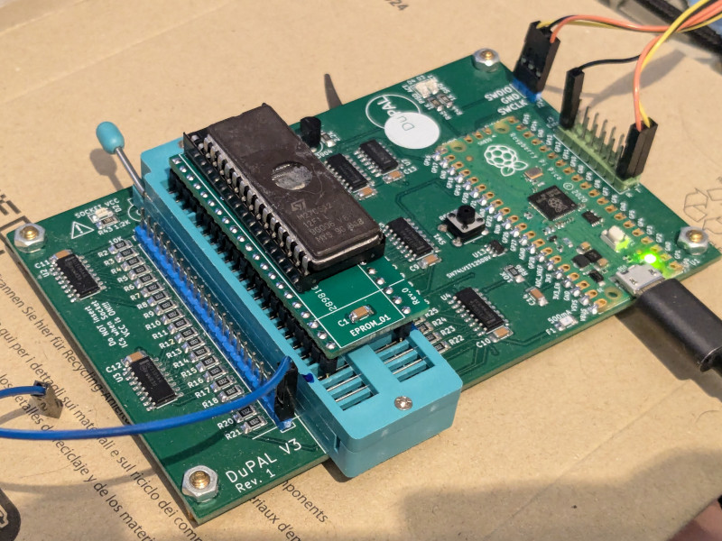

# EPROM_01 POD for dupico

## DISCLAIMER

Any use of this project is **under your own responsibility**.
You will be responsible of checking the correct construction and functionality of your board and the compatiblity of the chips You will insert into it.
By using this project You will agree that I cannot be held responsible if it will destroy any of your devices, damage your computer, burn down your house or whatever.

**Do NOT come to me for hand-holding** using this. It is NOT a plug-and-play tool, and it is something I created **for my own use** and I released in case someone might have an use for it.

## Introduction

The EPROM_01 POD is an adapter for the DuPAL V3 (AKA "dupico") meant to support the most common 24/28/32 pin ROMs, the only requirement being that they can be powered by 5V, have GND in the lower left pin and VCC in the upper right.



### Usage

This device is inserted in the ZIF socket of the dupico: if you installed a ZIF42 socket, it will fill all the 42 pins, if you installed a 48 pin socket, make sure to leave the bottom 6 pins empty (fit this in the topmost part of the socket).

When you fit a ROM device in it, make sure to align it to the bottom of the pod socket (so, a 28 pin device will leave empty the topmost 4 pins in the socket). 

Pin 32 on the pod socket is **hardwired to VCC**, there are other 7 selectable pins that can provide power, configured with 3 pins on the **ZIF42** socket:

| 22 | 23 | 24 | -> | Powered Pin (32 pin socket) |
| -- | -- | -- | -- | --------------------------- |
|  0 |  0 |  0 |    | 30 / 32                     |
|  0 |  0 |  1 |    | 28 / 32                     |
|  0 |  1 |  0 |    | 26 / 32                     |
|  0 |  1 |  1 |    | 25 / 32                     |
|  1 |  0 |  0 |    | 24 / 32                     |
|  1 |  0 |  1 |    | 23 / 32                     |
|  1 |  1 |  0 |    | 20 / 32                     |
|  1 |  1 |  1 |    | 32 only                     |

#### Socket connections

This drawing shows how the pin on the 32 socket are wired to the pins on the dupico's ZIF42.

```
            __ __
   1 ---> 1   U  32 <--- +5V (fixed)
   2 ---> 2      31 <-- 41
   3 ---> 3      30 <-- 40 --- Selectable +5V
   4 ---> 4      29 <-- 39
   5 ---> 5      28 <-- 38 --- Selectable +5V
   6 ---> 6      27 <-- 37
   7 ---> 7      26 <-- 36 --- Selectable +5V
   8 ---> 8      25 <-- 35 --- Selectable +5V
   9 ---> 9      24 <-- 34 --- Selectable +5V
  10 --> 10      23 <-- 33 --- Selectable +5V
  11 --> 11      22 <-- 32
  12 --->12      21 <-- 31
  13 --> 13      20 <-- 30 --- Selectable +5V
  14 --> 14      19 <-- 29
  15 --->15      18 <-- 28
GND ---> 16______17 <-- 27

```

## Hardware

The board was designed with [KiCad](https://kicad.org/) EDA.

In its current form, the board is relatively simple build, using through-hole and (non fine pitched) SMD components.

### Bill of Materials

| Component         | Qty | Type / Value                   | Notes                                                                                            |
| ----------------- | --- | ------------------------------ | ------------------------------------------------------------------------------------------------ |
| J1                |  2  | 21 pin 2.54mm headers          | Use rounded pin headers to put less stress on dupico ZIF, snip the protruding part of the header |
| C1, C2            |  2  | 100nF / 1206 / ceramic         |                                                                                                  |
| Q1 - Q7           |  7  | MMBT3906                       |                                                                                                  |
| J2                |  1  | 32 pin wide socket             | Solder this AFTER the two J1 headers, you can use a ZIF32 socket.                                |
| U2                |  1  | 74ACT138 SOIC-16               |                                                                                                  |
| R1 - R7           |  7  | 1K / 1206                      |                                                                                                  |

If you wish to use a 74HCT04 for U1, use a 2.2K resistor for R1.

## Errata

- Rev. 0 requires a bodge wire, see changelog for details
- Rev. 0 and 1 have the footprint of 2N3906 reversed. With these revisions, you need to rotate the transistor in respect to the footprint!
