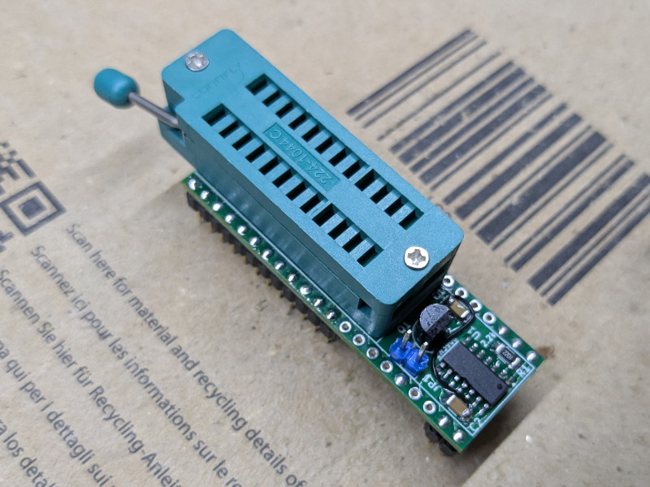

# PAL POD for dupico

## DISCLAIMER

Any use of this project is **under your own responsibility**.
You will be responsible of checking the correct construction and functionality of your board and the compatiblity of the chips You will insert into it.
By using this project You will agree that I cannot be held responsible if it will destroy any of your devices, damage your computer, burn down your house or whatever.

**Do NOT come to me for hand-holding** using this. It is NOT a plug-and-play tool, and it is something I created **for my own use** and I released in case someone might have an use for it.

## Introduction

The PAL POD is an adapter for the DuPAL V3 (AKA "dupico") meant to support 20 and 24 pin PAL (and pinout compatible) devices.



### Usage

This device is inserted in the ZIF socket of the dupico: if you installed a ZIF42 socket, it will fill all the 42 pins, if you installed a 48 pin socket, make sure to leave the bottom 6 pins empty (fit this in the topmost part of the socket).

When you fit a PAL device in it, make sure to align it to the bottom of the ZIF24 socket (so, a 20 pin device will leave empty the topmost 4 pins in the socket). 

**Pulling high pin 22 of the ZIF42 socket will turn on the transistor on the pod, which in turn will provide 5V to pin 22 of the ZIF24 socket**, pin 12 is hardwired to GND, and pin 24 to VCC.

Some old PAL/GAL devices require more current than the switching via pin 22 can provide. In these cases, close JP1 to bypass the transistor and provide 5V directly.

#### Socket connections

This drawing shows how the pin on the ZIF24 sockets are wired to the pins on the dupico's ZIF42.

```
            __ __
   1 ---> 1   U  24 <--- +5V
   2 ---> 2      23 <-- 41
   3 ---> 3      22 <-- 40 --- 5V if ZIF42 pin 22 is HIGH
   4 ---> 4      21 <-- 39     or JP1 closed
   5 ---> 5      20 <-- 38
   6 ---> 6      19 <-- 37
   7 ---> 7      18 <-- 36
   8 ---> 8      17 <-- 35
   9 ---> 9      16 <-- 34
  10 --> 10      15 <-- 33
  11 --> 11      14 <-- 32
GND ---> 12______13 <-- 31

```

## Hardware

The board was designed with [KiCad](https://kicad.org/) EDA.

In its current form, the board is relatively simple build, using through-hole and (non fine pitched) SMD components.


### Bill of Materials

| Component         | Qty | Type / Value                   | Notes                                                    |
| ----------------- | --- | ------------------------------ | -------------------------------------------------------- |
| J1                |  2  | 21 pin 2.54mm headers          | Use rounded pin headers to put less stress on dupico ZIF |
| C1, C2            |  2  | 100nF / 1206 / ceramic         |                                                          |
| JP1               |  1  | 2 pin 2.54mm header            | Bypasses the transistor and provides direct 5V           |
| Q1                |  1  | 2N3906 TO92                    |                                                          |
| J2                |  1  | narrow ZIF24 socket            | Solder this AFTER the two J1 headers                     |
| U1                |  1  | 74ACT04 SOIC-14                |                                                          |
| R1                |  1  | 1K / 1206                      |                                                          |

## Errata

- Rev. 0 requires a bodge wire, see changelog for details
- Rev. 0 and 1 have the footprint of 2N3906 reversed. With these revisions, you need to rotate the transistor in respect to the footprint!
